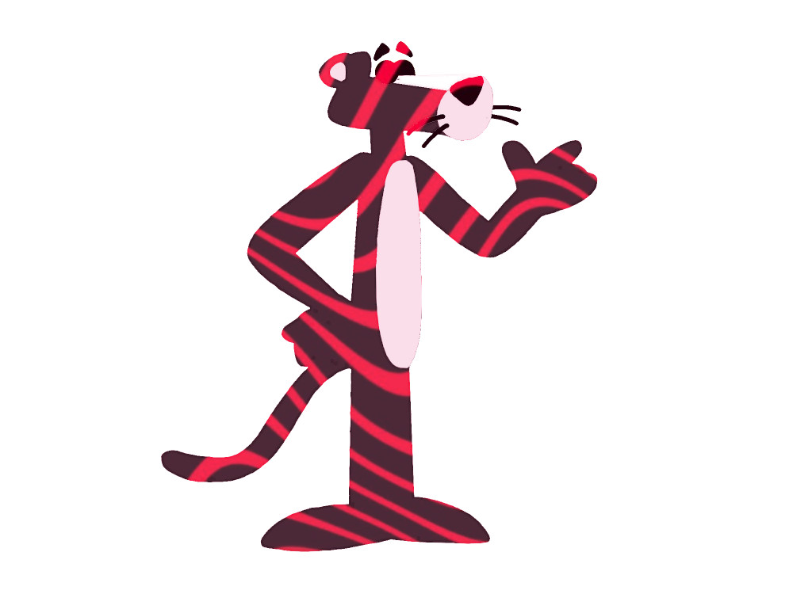

# t04 - Pink Panthers

Good One.

| Last Name | First Name | CSU eName | GitHub Username | CSU Email |
| --- | --- | --- | --- | --- |
| Lertola | Nick | nlertola | nlertola | nlertola@rams.colostate.edu |
| Aubin | Zach | aubin | zachaubin | aubin@rams.colostate.edu |
| Walz | Sarah | spwalz | spwalz | spwalz@colostate.edu |
| Nielsen | Lindsey | binzerlu | lindseynielsen | binzerlu@colostate.edu | 
| Dudek | Mari | mjdudek | www-mari | mjdudek@rams.colostate.edu |

 # Team Preferences 
  Our team discussed communication as the solution to nearly every issue indicated with our preferences. For example, as a management of differing work ethics and if people aren’t pulling their weight. Honest communication will be our main way of fixing issues in our team. Sometimes we feel that direct communication will be effective as well. Exchanging ideas and sharing differing views is a great way for our team to learn to work together and reach a compromise. It is important to keep our lines of communication open especially when teammates might be going through a rough patch. We agreed to talk with one another to sort out our issues in order to be the best team we can be.

  We agreed Slack and Teams have been good ways for us to communicate, for most of us direct text messaging is also a great way to reach us if needed. We believe a same-day response is a reasonable expectation for the group. Messages received after 7pm should not expect replies until the next day. Members are willing to check their messages before they go to bed to ensure this deadline is met. If someone is unable to reply with more than a response-ping at some point, they should at least say “I’m very busy and will get back to you tomorrow,” or similar to ensure that communication is frequent and contact is reliable. We are all free most afternoons and we have agreed to schedule weekly meetings on a week to week basis. We agree to meet more often to discuss our work, our plans for our project, and any issues as they arise.
  
  If we notice that one teammate is doing way more or less than the rest of the group, we decided that it is best to have an open and honest discussion about why this is happening. Since we have decided that communication is the best way to combat problems, we will try to solve any issues with project workloads directly. Our main goal in this course is to collaborate, learn, and play to each other’s strengths to produce the best possible product as a team. 
