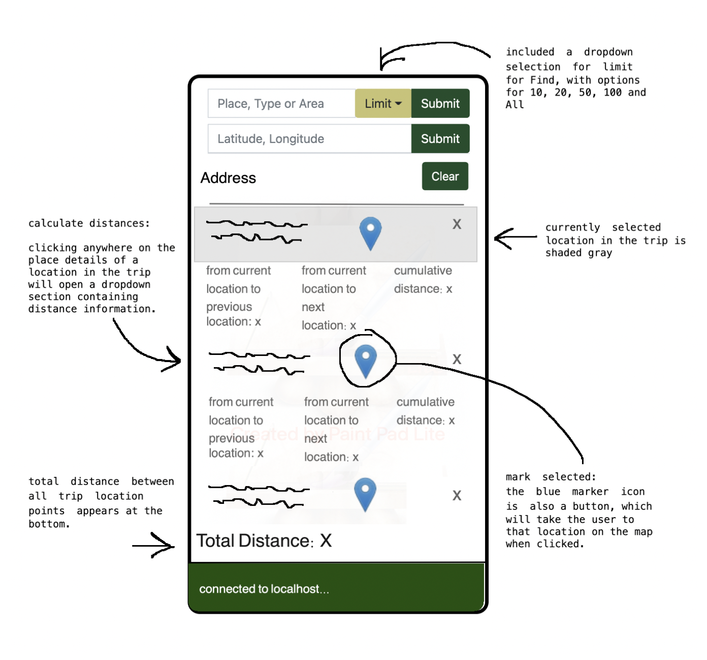
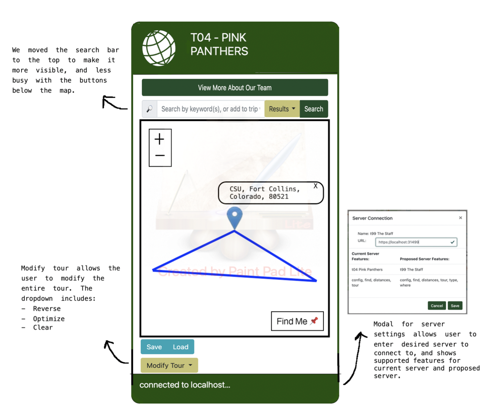

# Introduction

This document describes the architecture and design of a single page web application that interacts with microservices via RESTful APIs.
The key elements in this document include the architecture, user interface, client components, and server classes.

This is a living document that is updated as changes are made each sprint.
The initial document describes the Base code students are given as a starting point for the semester.
Students are expected to update this document as changes are made each sprint to reflect the evolution of their application and key decisions they make.
The Base section serves as an example.

# Base

The Base is a simple application to provide the architecture to the students at the beginning of the semester.
The JavaScript code will be useful examples for students to learn from and leverage in the code they write for sprint 1.
The progressive display of information using collapsible sections and popups will serve as examples of good user interface design.
The overall design is somewhat minimalist/simple for the intended mobile device audience.

### Architecture

The Base architecture is a JavaScript single page web application in an HTML5 browser that uses RESTful APIs to access Micro-services provided by a Java server running on Linux.
The client consists of a minimal index.html file that loads and executes the bundled JavaScript application.
The client and server files are bundled into a single JAR file for execution on the Linux server at a specified port.
The browser fetches the client files from the server on the specified port.

The browser loads the index.html file (by default) which in turn loads the bundled JavaScript single page application bundle.js.
* The single page application makes RESTful API requests to the server on the same port using  JavaScript's asynchronous fetch.  
* A protocol document describes the JSON format for the RESTful API requests and responses.
* JSON Schemas are used to verify requests on the server side and responses on the client side.
* On the client, ReactJS renders the application using ReactStrap, Leaflet, and application defined components.
* GSON is used on the server to convert JSON requests to Java objects and Java objects to JSON responses.
* The client (ulog) and server (SLF4J) logging mechanisms control debugging output during development and production - print statements and console logging should never be used. 

The following architecture elements are not included in the Base system.
They will be added later in the semester.
* Client filesystem .
* Server SQL .
* Server concurrency.

### User Interface

The basic screen in black shows the view on a mobile device, with a header, footer, and map.
The header contains a earth logo and the team name obtained from the server when the client was loaded.
The footer contains a connection icon along with the current server name and server URL the client is connected to.
The blue areas highlight the actions that may be performed.

Rather than buttons or icons to signify actions, we are associating actions with elements that are already on the screen to reduce the clutter.
We are using both popups and collapsible sections in this design rather than choosing to use one exclusively.
* Collapsible/Hidden sections are used for the map and about sections since they have a significant amount of content and we don't need to see them at the same time.
* A popup is used for the URL change since we want to control the interaction until the operation is completed. It seemed more natural than another collapsible section.

#### Clicking on the map places a marker.
Whenever a user clicks on the map, the client should display a marker with latitude and longitude at that location.
We only maintain a single marker at this point displaying the most recently clicked location.

#### Clicking on the team name should tell me more about the team.
Whenever a user clicks the team name in the header, a collapsible section should appear under the header with information about the team.
The collapsible map should disappear so only the about or map are displayed.
A close button / icon in the top right corner of the about will close the about and return the map to display.
A simple toggle in state should be able to control this rendering.
The about page should contain the team name as a heading, but be otherwise blank in base. 

During the completion of this task, we added a button to make navigating to the about page more clear to the user.

#### Clicking on the URL in the footer should let me change the server.
Whenever a user clicks on the URL a popup should open showing the team name, the URL in an input text box, and a Cancel button.
When the user modifies the URL, a Test button should appear and the server name should disappear.
When the Test button is clicked, it will attempt to connect to the server.
If not successful, nothing changes and the user may continue to make URL changes or click the Cancel button to return to the original sever (it shouldn't change).
If successful, the new server name should appear and a Save button should replace the Test button.
When the user clicks the Save button, the server connection should change and the popup closes, revealing the new servername and URL in the footer.

### Component Hierarchy
The component hierarchy for the base application depicted below shows the our top level App component with four children components.
* App renders the major components on the screen.
* Header renders an icon and a team name in the top banner.
* Footer renders the current server connection in the bottom footer.
* Atlas renders a map.
* About renders information about the team.

We do not show the many ReactStrap components in this hierarchy, even though they will appear when you are debugging on the client.

### Class Diagram
The class diagram for the base application depicted below shows the basic structure of the web server application.

The classes in blue represent the classes specific to this application.  
* WebApplication processes command line parameters and creates MicroServer.
* MicroServer start a web server on the given port, configures the server for security, static files, and APIs for different types of requests, and processes the requests as they arrive.
* JSONValidator verifies a request is properly formatted before attempting to process it using JSON Schemas.
* ConfigRequest is a specific request that allows the server to respond with its configuration to allow interoperability between clients and servers. 
* RequestHeader defines the basic components of all requests.

The classes in orange represent the external libraries used by the application.
Often there are several related classes but we've listed only one to simplify the diagram.
* GSON converts a JSON string into a Java object instance.
* Spark provides the necessary web support for our MicroServer.
* JSON provides libraries to manipulate JSON objects using the JSON Schema libraries.
* Logger provides a centralized logging facility used in all of the application classes.

# Sprint 1
### User Interface

We will include an interactive map as well as a list during the Trip epic. Also, clicking on the team name at the top will open up an About page, including additional information about each of the team members and individual avatars. These user interface implementation details are subject to change as we get further into the project. 
#### About Page

This is what the about page will look like on browser and on phone after the About epic. Clicking the team name from the home screen will take the user to the about page where our team name, team picture, mission statment, along with all of our bios and pictures will be here. We decided to use different pictures of the pink panther as our profile pictures to keep a common theme. We also opted to keep our bios short and sweet. 

### Components

We will be reading through the 'base' documentation related to the component hierarchy. At this time we see App: Header, About, Atlas, Footer. We plan to modify About significantly as one entire epic revolves around completing this section. For Atlas, we will be adding information related to a list of recently clicked locations. This may be in the form of a sub-component and we will address that during the sprint.

### Classes
We will discuss class hierarchy and code practices after we work on the CC assignments which are due Sunday. From there we will try to understand the code that was uploaded at the end of Friday, starting on Monday. Then when we understand those classes and the established structure, we will follow the standard practices accordingly. The classes we plan to add will follow from this, on Monday. Generally we will class families related to "insert new item to list", "remove item from list", and "clear list". There may be others, each of these families will be broken down according to CC, company practice, existing code architecture style, and our internal team decisions.

# Sprint 2
## Screen layout
### Where am I?

This was our orignal planned screen layout for Where am I?
For the Where am I epic, we will add a small button, in the corner of the map in order for the user to move the map back to their current location. Also, there will be a pin that marks the users location when he first arrives and again when he clicks the button. Plus, his location is also visibile under history. 

### Where is?

This was our original planned screen layout for Where is?
For the Where is epic there will be two small text boxes next to each other underneath the map where users can enter in their latitude and longitude. if inputed answers are bad values and the users clicks the go button, a warning will pop up underneath the text boxes propmting the user that the values are bad and the go button will not preform its duties. if the values are good the button will trigger the map to place the marker on the desired longitude and latitude.

### Final Design

By the end of our Sprint 2 this is how our phone screen layout looked like. 
We have two search boxes, one for searching the coordinates (Where is? Epic) and one for searching for various places (Find Places Epic). 
Our phone screen layout is slightly  different from the desktop layout so that it is more readable. 
For example, we don't show the coordinates in our places history on the mobile view, as it made the address unreadable. 
We also decided to change the search  boxes, so that on the mobile view it does not show the name of the search box, 
this means that again the user is able to actually use and type into the search bar without it going out of view. 
Plus, with the example of the background text in the search box, it is still easy for the user to know what these boxes are for. 
This allows us to have an easy and intuitive user interface no matter the device used to access our travel site. 

By the end of Sprint 2, this is what the browser view of the webpage looks like.
Although it is very similar to the mobile view, there are a few key differences. The two search boxes for find places epic and where is epic have an aditional grey box indicating what you are searching as the background text in the text box goes away as you start typing. The table that holds the history of all the places selected has the additional place details, latitude and longitude and a delete row button. This whole table adjusts to the size of the browser that the user prefers. Some additional changes from Sprint 1 include: adding a find me button to map, the two search boxes, place details on marker and table and overall clean up for aesthetics, understandability and making the webpage easy for everyone to use.

### Components

### Server Class diagram

For the Protocol Find Feature epic we will add a FindRequest file on the server side to handle searches.
This will require adding a Find class to handle API calls. It will use the request header and log any errors.

# Sprint 3
## Screen layout

For Sprint 3 there are multiple epics that will change our screen layout. 
For Epics Show Trip and Mark Selected, this is how the phone layout would look. 
For show trip there would be a button to show the trip. This would then create a marker for each of 
the locations in the trip history and would connect them with lines to look like a roundtrip. 
For Marker Select if the users selects one of addresses the table changes color and 
on the map the marker will pop up to this location. On a desktop the table
will also be hoverable. 
For the Calculate distances epic we will show the total distance at after the table. 
The Cumulative distance will get its own column in the table showing how much 
each additional location adds to the distance traveled. 
For the adjacent addresses we will design a drop down that appears when the user 
clicks on one of the locations (which will also move the marker). 
The drop down will showcase some other details as well as the distances to the two adjacent addresses. 
For the units epics, we have a small settings button at the top of the map that will allow the user to 
switch between various units and enter their own. 

### Final Design

By the end of Sprint 3, this is the design of our user interface. For the Calculate Distances epic, we created an additional dropdown table section that can be accessed by clicking anywhere on the place details of a location in the trip table. The dropdown provides information including cumulative distance, distance between current location & previous location, and distance between current location & next location. Also for the Calculate Distances epic, we’ve included a Total Distance count at the bottom of the trip table. For the Show Trip epic, we created a blue line between each selected location in the trip. The line also returns to starting location. If the user removes a location from the trip list, the line to the location will disappear. For the Mark Selected epic, the blue marker icon in the trip list is also a button that will take the user to that location on the map. An additional design change between Sprint 2 and Sprint 3 is a dropdown option to select a limit for Find places, so the user can choose between 10, 20, 50, 100 or All results when searching for a place. 

## Components

In this sprint we split apart Atlas into DisplayResultsModal, TableCompnent, and SearchComponent

## Server Class diagram

We added the Distance Request file in this Sprint. 

# Sprint 4
## Screen Layout

In Sprint 4 we will keep most of our layout as-is and add three buttons: Save, Load, and Optimize. Save and Load will allow the user to save or load their map and list of destinations in order. Optimize will re-order the trip so that the total distance travelled is less than or equal to their current trip, keeping the first location static.
### Final Design

By the end of sprint 4 our team stuck very closely to the beggining of the sprint UI plans. We added the two buttons for Save and Load, the only difference is them being on the left hand side instead of the right. When clicking the save button a modal will pop up prompting the user to pick to save either map in SVG and KML or tour in CSV or JSON. When clicking the load button a modal will pop up prompting the user to choose a file they wish to upload. If the user wishes to not be in the modal they can simply press the x button or click off the modal and it will go away. We also changed the search boxes and combined them into one to save space and for simplicity on our site. Lastly we added a optimize button at the top of the table next to the clear button for the user to press when they want to optimize the tour.

## Components

For this sprint, we plan on adding three new files, all of whom will be children of Atlas. 
We will have LoadTour.js which will do the frontend, backend, and user state of the load functionality. 
We will also have the SaveTour.js which will handle the frontend and backend of 
Save. Both files will have the respective buttons and the settings associated with them,
as well as the upload/download functionality. 
We also want to continue our work from sprint 3 which is breaking down Atlas further. 
It is still a very long file, so we want to take most of the map functionality out of 
Atlas and put it into Map.js. With that our general state will be stored in Atlas
and referenced by its children. However, SearchComponent.js does have its own state, 
which only partially references Atlas.  

By the end of the sprint, we had changed our components set up further. We decided to create one 
file for the Optimize Component that responds to the server and also create the user interface
functionality. We also created one component file for the SaveLoad Buttons called SaveLoadComponent, 
from this file, if the user clicked on the button would open the respective modal either in the 
SaveModal file or the LoadModal file. Originally we were going to have all files just be direct
children of Atlas, but as we coded we decided it would be more efficient to have a SaveLoadComponet
that was a direct child of Atlas and then make SaveModal/LoadModal children of SaveLoadComponent. 

## Server Class diagram

For this sprint, we plan to add another request file to our server. This file will be TourRequest.java 
and handle the optimization of a tour. It will take in the list of locations and reorder them so that 
the total tour distance is shorter than or equal to what it currently is. It will also take in a time 
limit and return the newly ordered list of locations in that amount of time or less.

# Sprint 5
## Screen Layout

For the goal user interface for this sprint will include a table in the server connection modal that 
includes what elements the current or proposed server supports. There will also be an additional modal 
for filter trip that will include an identical table to the locations table and a search box that is 
used to search within the trip for something. The button for optimization will be moved to the same row 
as the save and load buttons and filter results button will be there aswell. This way there is no empty 
space and there is a row of buttons for use. Where the optimization button was will be replaced with 
the reverse trip button that will reverse the trip. There will also be arrows on each row that will 
move that location up or down in the table to reorder and modify the table. 
### Final Design

By the end of sprint 5, due to UX testing and the User Experience epic, our team changed our design quite
a bit. Our server settings modal is the same as we planned: a table that shows the supported features in both
the current server and the proposed server. We decided against doing the filter tour epic. Another design
change we made is to put all tour modifications into a dropdown to make the screen look cleaner and have less
buttons. We included a "Modify Tour" dropdown which has "Reverse", "Optimize", and "Clear". We also moved the 
places and lat/long searchbar to above the map. Inside the trip table, we made some major design changes as
well. First, we changed our Mark Selected icon to match the CSU iconography theme. Also, for the Modify
Tour epic, we put all of the individual move functions (move up, move down, move to start) as a dropdown
in a column so that they weren't separate buttons. Lastly, we noticed users had issues with locating the 
distances information during UX testing so we included an info button under the addresses, which
includes distance information and the ability to add notes and edit the address for each location. 

## Components

For this sprint, we plan on adding three more files. For the Modify Tour epic, we will add 
another file that will be the child of TableComponent.js. This will allow us to modify
the table as well as add notes to locations. Then for the filter tour epic, we already 
have a SearchComponent that we added last sprint that lets us filter through the search results. 
So for this sprint, we will take the basic filter functionality of that file and then also create
two other files that use that filter functionality. One, SearchThroughSearchResults.js where we will
move our current code that actually filters through the search results. The other file, 
SearchThroughTable.js, will take the functionality of SearchComponent.js and use it to 
filter through the table. By breaking the files and functionality up in this way we will 
hopefully be able to avoid a lot of code duplication. 

By the end of our sprint, we had changed up our Components further. We had decided against adding all 
of the Modify tour features into one file and instead had part of them (moving the trip) in the 
TableComponets and then choose to have an extra file for the Note functionality. 
This simplified our code and allowed us to keep all the relevant code together. 
The other major change from our plan came from the fact that we didn't have the time to finish 
the filter tour epic. So there was no need to divide that functionality and create those extra 
files. Instead, we kept everything in the SeachComponent.js file. 

## Server Class diagram

For this sprint, nothing will change in our server class diagram. We are still using the existing 
Config, Find, Distance, and Tour request files.
